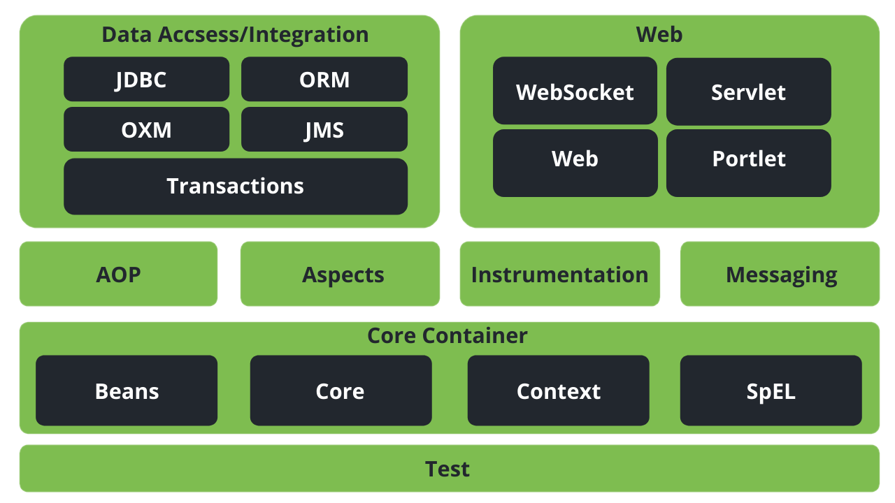

# Spring Framework
Spring is a lightweight framework. It can be thought of as a ***framework of frameworks*** because it provides support to various frameworks such as *Struts, Hibernate, Tapestry, EJB, JSF, etc*. The framework, in broader sense, can be defined as a structure where we find solution of the various technical problems.
## Advantages of Spring Framework
### 1. **Predefined Templates**
   - Spring framework provides templates for JDBC, Hibernate, JPA etc. technologies. So there is no need to write too much code. It hides the basic steps of these technologies.
### 2. **Loose Coupling**
   - The Spring applications are loosely coupled because of dependency injection.
### 3. **Easy to test**
   - The Dependency Injection makes it easier to test the application. The EJB or Struts application requires a server to run the application but the Spring framework doesn't        require a server.
### 4. **Lightweight**
   - The Spring framework is lightweight because of its POJO implementation. The Spring Framework doesn't force the programmer to inherit any class or implement any interface.        That is why it is said to be non-invasive.
### 5. **Fast Development**
   - The Dependency Injection feature of Spring Framework and its support for various frameworks makes the development of JavaEE applications easy.
### 6. **Powerful abstraction**
   - It provides powerful abstraction to JavaEE specifications such as JMS, JDBC, JPA and JTA.
### 7. **Declarative support**
   - It provides declarative support for caching, validation, transactions and formatting.
## Spring Modules
The Spring framework comprises many modules such as core, beans, context, expression language, AOP, Aspects, Instrumentation, JDBC, ORM, OXM, JMS, Transaction, Web, Servlet, Struts etc. These modules are grouped into Test, Core Container, AOP, Aspects, Instrumentation, Data Access / Integration, Web (MVC / Remoting)

## - **Data Access / Integration**
  - ### JDBC
    - The JDBC module provides a JDBC-abstraction layer that removes the need for tedious JDBC related coding.
  - ORM
    - The ORM module provides integration layers for popular object-relational mapping APIs, including JPA, JDO, Hibernate, and iBatis.
  - ### OXM
    - The OXM module provides an abstraction layer that supports Object/XML mapping implementations for JAXB, Castor, XMLBeans, JiBX and XStream.
  - ### JMS
    - The Java Messaging Service JMS module contains features for producing and consuming messages.
  - ### Transaction
    - The Transaction module supports programmatic and declarative transaction management for classes that implement special interfaces and for all your POJOs.

## - **Web**
  - ### Web
    - The Web module provides basic web-oriented integration features such as multipart file-upload functionality and the initialization of the IoC container using servlet         listeners and a web-oriented application context.
  - ### Web-MVC
    - The Web-MVC module contains Spring's Model-View-Controller (MVC) implementation for web applications.
  - ### Web-Socket
    - The Web-Socket module provides support for WebSocket-based, two-way communication between the client and the server in web applications.
  - ### Web-Portlet
    - The Web-Portlet module provides the MVC implementation to be used in a portlet environment and mirrors the functionality of Web-Servlet module.

### - **Test**
  - This layer provides support for testing with *JUnit* and *TestNG*.
### - **Spring Core Container**
  - **Core**
    - The Core module provides the fundamental parts of the framework, including the IoC and Dependency Injection features.
  - **Beans**
    - The Bean module provides BeanFactory, which is a sophisticated implementation of the factory pattern.
  - **Context**
    - The Context module builds on the solid base provided by the Core and Beans modules and it is a medium to access any objects defined and configured. The                       ApplicationContext interface is the focal point of the Context module
  - **Expression Language**
    - The SpEL module provides a powerful expression language for querying and manipulating an object graph at runtime.
### - **AOP, Aspects and Instrumentation**
  - These modules support aspect oriented programming implementation where you can use *Advice, Pointcuts etc.* to decouple the code.
  - The aspects module provides support for integration with *AspectJ*.
  - The instrumentation module provides support for class instrumentation and classloader implementations.

### - **Web**
  - This group comprises *Web, Web-Servlet, Web-Struts* and *Web-Portlet*. These modules provide support to create web applications.
